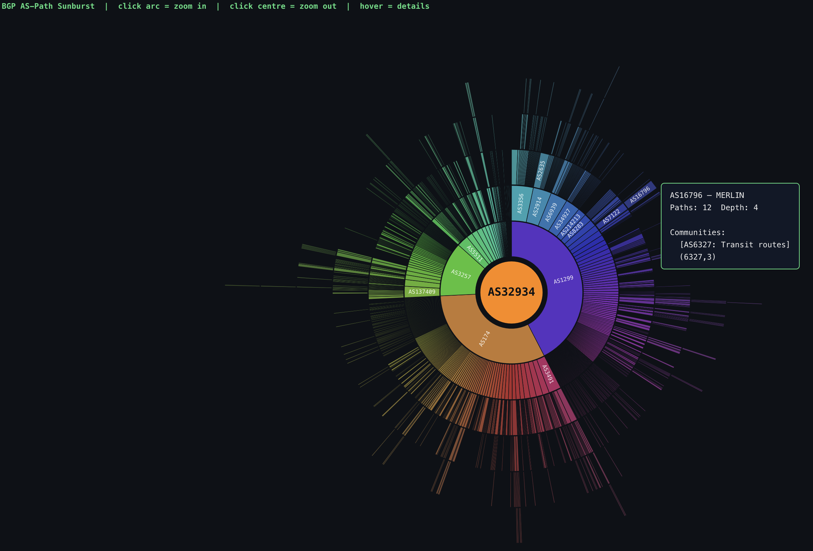

# BGP AS-Path Sunburst

A zero-dependency **bookmarklet** that visualises BGP AS-path data from [bgp.tools/super-lg](https://bgp.tools/super-lg) as an interactive zoomable sunburst chart, rendered on an HTML5 Canvas.



---

## Installation

1. Open [install.html](https://htmlpreview.github.io/?https://raw.githubusercontent.com/network-scripts/super-lg-visualizer/refs/heads/main/install.html)
2. Drag the button into your browser bookmark bar, or right-click it and save to bookmarks.

---

## Usage

1. Go to [bgp.tools/super-lg](https://bgp.tools/super-lg) and search for any prefix (e.g. `8.8.8.0/24`)
2. Click the **BGP Sunburst** bookmark
3. A full-screen overlay appears immediately — no network requests, no loading

| Interaction | Action |
|---|---|
| **Click arc** | Zoom into that subtree |
| **Click centre** | Zoom out one level |
| **Hover** | Tooltip: org name · path count · BGP communities |
| **✕ button** | Close overlay |

---

## How it works

```
Collector peer → … → transit AS → … → origin AS (centre)
```

The chart is rooted at the **origin AS** (the AS that announces the searched prefix). Each concentric ring represents one more transit hop outward toward the collecting peers. Arc width is proportional to the number of observed paths flowing through that segment.

### Data pipeline

```
DOM walk (TreeWalker)
  │
  ├─ BGP.as_path: <abbr title="Org">ASN</abbr> …   → path array + org names
  ├─ BGP.community: (x,y) <abbr>[decoded]</abbr>   → community strings per ASN
  └─ BGP.large_community: <abbr>[decoded]</abbr>   → large community strings
        │
        ▼
  Deduplicate consecutive ASNs (collapse prepend padding)
        │
        ▼
  Build trie (origin → transit → collector)
        │
        ▼
  Assign arc angles proportional to path count
        │
        ▼
  Render on HiDPI-aware Canvas 2D
```

---

## Files

| File | Description |
|---|---|
| `bgp_sunburst.js` | Full source with comments — the canonical version |
| `install.html` | Open in Firefox to get the drag-and-drop bookmarklet button |
| `screenshot.png` | Preview image |

---

## License

MIT
